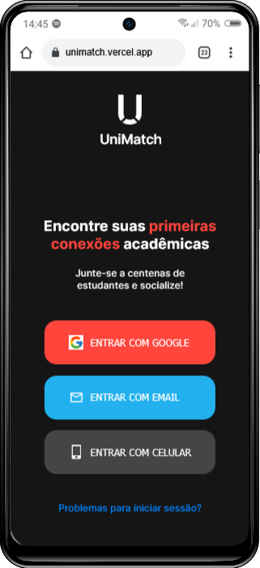
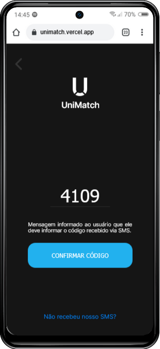
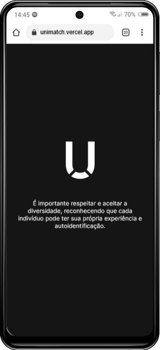
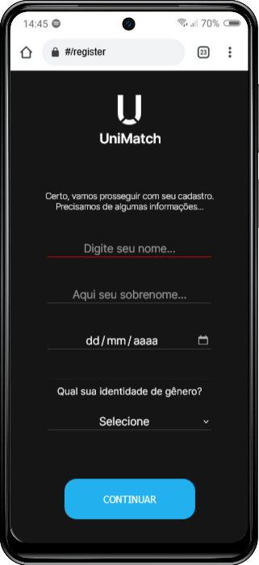

  
_“Encontre seu match acadêmico: conectando estudantes dentro e 
fora da sala de aula.”_
  
<strong> O UniMatch é</strong> uma plataforma que conecta estudantes universitários com 
interesses semelhantes dentro e fora da sala de aula. Com uma interface intuitiva e 
funcionalidades similares as ferramentas já existentes no mercado, é possível criar um perfil com informações 
pessoais, interesses acadêmicos e hobbies. 
  
<strong> O algoritmo</strong> do UniMatch utiliza essas informações para sugerir potenciais matches 
com outros estudantes da mesma universidade. A partir daí, os usuários podem trocar 
mensagens e marcar encontros para estudar juntos, participar de eventos 
universitários ou simplesmente fazer novas amizades.
  
<strong> O objetivo</strong> do UniMatch é ajudar os estudantes universitários a ampliar seu círculo 
social e aproveitar ao máximo a vida universitária. Além disso, ao se conectar com 
pessoas com interesses semelhantes, os usuários podem encontrar parceiros para 
projetos acadêmicos e até mesmo futuras oportunidades profissionais. 
  

  
  
  
  
  

Esta Aplicação *Web* está sendo desenvolvida para dispositivos com tela **(380x800 Mobile)** 🟡

Design das Wireframes (FIGMA): <a href="https://www.figma.com/file/vdgJqeTlBXJYXx35ed9ZYC/Match-App?type=design&node-id=0%3A1&t=2QPbog0MAznD5Xv0-1">Clique aqui</a> 🟢

Fluxos da Aplicação: <a href="https://miro.com/app/board/uXjVMGbhsqo=/?share_link_id=488852523176">Clique aqui</a> 🟢

Repositório Principal API: <a href="https://github.com/Juanpi92/api_uva_match">Clique aqui</a> 🟢

Repositório Principal FRONT: <a href="https://github.com/plfmoura/match-app">Clique aqui</a> 🟢

### Contribuidores (em todas as dependências do projeto): 

